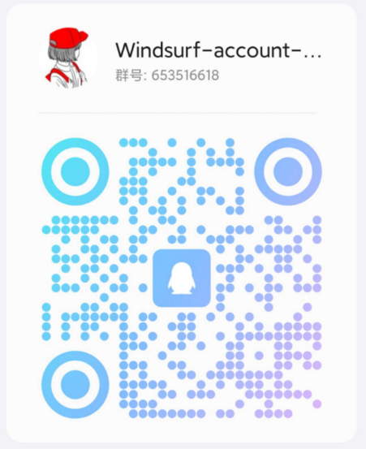
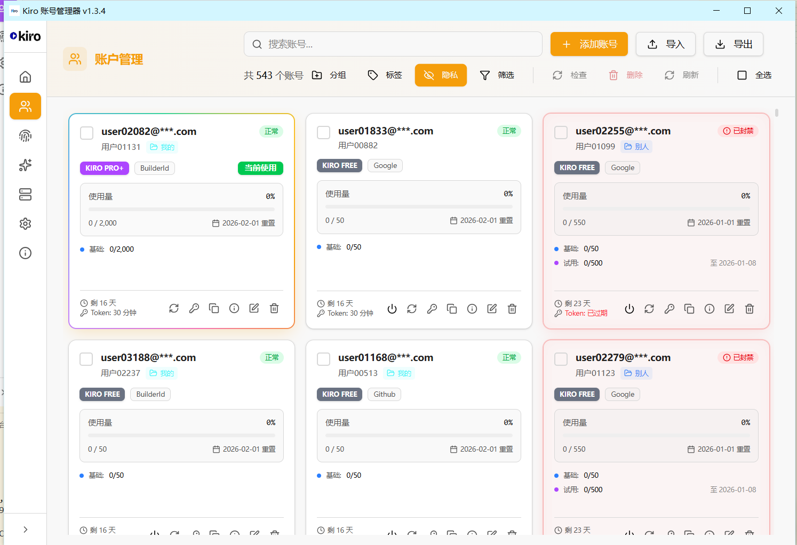

# Kiro 账户管理器

<p align="center">
  
</p>

<p align="center">
  <strong>QQ 交流群: 653516618</strong>
</p>

<p align="center">
  
</p>

<p align="center">
  <strong>一个功能强大的 Kiro IDE 多账号管理工具</strong>
</p>

<p align="center">
  支持多账号快速切换、自动 Token 刷新、分组标签管理、机器码管理等功能
</p>

<p align="center">
  <a href="README.md">English</a> | <strong>简体中文</strong>
</p>

---

## ✨ 功能特性

### 🔐 多账号管理
- 支持添加、编辑、删除多个 Kiro 账号
- 一键快速切换当前使用的账号
- 支持 Builder ID 和 Social（Google/GitHub）登录方式
- 批量导入导出账号数据

### 🔄 自动刷新
- Token 过期前自动刷新，保持登录状态
- Token 刷新后自动更新账户用量、订阅等信息
- 开启自动换号时，定期检查所有账户余额

### 📁 分组与标签
- 通过分组和标签灵活组织管理账号
- 多选账户批量设置分组/标签
- 一个账户只能属于一个分组，但可以有多个标签

### 🔑 机器码管理
- 修改设备标识符，防止账号关联封禁
- 切换账号时自动更换机器码
- 为每个账户分配唯一绑定的机器码
- 支持备份和恢复原始机器码

### 🔄 自动换号
- 余额不足时自动切换到其他可用账号
- 可配置余额阈值和检查间隔

### 🎨 个性化设置
- 21 种主题颜色可选（按色系分组显示）
- 深色/浅色模式切换
- 隐私模式隐藏敏感信息

### 🌐 代理支持
- 支持 HTTP/HTTPS/SOCKS5 代理
- 所有网络请求通过代理服务器

### 🔄 自动更新检测
- 自动检测 GitHub 最新版本
- 显示更新内容和下载文件列表
- 一键跳转到下载页面

---

## 📸 界面预览

### 主页
显示账号统计、当前使用账号详情、订阅信息和额度明细。


### 账户管理
管理所有账号，支持搜索、筛选、批量操作，一键切换账号。



### 机器码管理
管理设备标识符，防止账号关联封禁，支持备份恢复。


### 设置
配置主题颜色、隐私模式、自动刷新、代理等选项。


### API 反代服务
提供 OpenAI 和 Claude 兼容的 API 端点，支持多账号轮询、Token 自动刷新、请求重试等功能。


### Kiro IDE 设置
同步 Kiro IDE 设置，编辑 MCP 服务器，管理用户规则（Steering）。


### 关于
查看版本信息、功能列表、技术栈和作者信息。


---

## 📥 安装说明

### Windows
直接运行安装程序 `.exe` 文件即可。

### macOS
由于应用未进行 Apple 代码签名，首次打开时 macOS 会提示"已损坏，无法打开"。请按以下步骤解决：

**方法一：终端命令（推荐）**
```bash
xattr -cr /Applications/Kiro\ Account\ Manager.app
```

**方法二：右键打开**
1. 在 Finder 中找到应用
2. 按住 `Control` 键点击应用（或右键点击）
3. 选择「打开」
4. 在弹出对话框中点击「打开」

### Linux
- **AppImage**：添加执行权限后直接运行
  ```bash
  chmod +x kiro-account-manager-*.AppImage
  ./kiro-account-manager-*.AppImage
  ```
- **deb**：使用 `dpkg -i` 安装
- **snap**：使用 `snap install` 安装

---

## 📖 使用说明

### 添加账号

1. 点击「账户管理」进入账号列表页面
2. 点击右上角「+ 添加账号」按钮
3. 输入账号的 SSO Token 或 OIDC 凭证
4. 点击确认完成添加

### 切换账号

1. 在账户管理页面找到目标账号
2. 点击账号卡片上的电源图标即可切换
3. 切换后 Kiro IDE 将使用新账号

### 批量设置分组/标签

1. 在账户管理页面勾选多个账号
2. 点击「分组」或「标签」按钮
3. 在下拉菜单中选择要添加或移除的分组/标签

### 机器码管理

1. 点击左侧「机器码」进入管理页面
2. 首次使用会自动备份原始机器码
3. 点击「随机生成并应用」可更换新机器码
4. 如需恢复，点击「恢复原始」即可

> ⚠️ **注意**：修改机器码需要管理员权限，请以管理员身份运行应用

### 导入导出

- **导出**：设置 → 数据管理 → 导出，支持 JSON、TXT、CSV、剪贴板多种格式
- **导入**：设置 → 数据管理 → 导入，从 JSON 文件恢复账号数据

---

## 🛠️ 技术栈

- **框架**: Electron + React + TypeScript
- **状态管理**: Zustand
- **样式**: Tailwind CSS
- **构建工具**: Vite
- **图标**: Lucide React

---

## 💻 开发指南

### 环境要求

- Node.js >= 18
- npm >= 9

### 安装依赖

```bash
npm install
```

### 开发模式

```bash
npm run dev
```

### 构建应用

```bash
# Windows
npm run build:win

# macOS
npm run build:mac

# Linux
npm run build:linux
```

### 构建多架构版本

```bash
# Windows 64位
npx electron-builder --win --x64

# Windows 32位
npx electron-builder --win --ia32

# Windows ARM64
npx electron-builder --win --arm64

# macOS Intel
npx electron-builder --mac --x64

# macOS Apple Silicon
npx electron-builder --mac --arm64

# Linux 64位
npx electron-builder --linux --x64

# Linux ARM64
npx electron-builder --linux --arm64
```

---

## 🚀 自动构建 (GitHub Actions)

项目配置了 GitHub Actions 工作流，支持自动构建所有平台和架构：

### 支持的平台

| 平台 | 架构 | 格式 |
|------|------|------|
| Windows | x64, ia32, arm64 | exe, zip |
| macOS | x64, arm64 | dmg, zip |
| Linux | x64, arm64, armv7l | AppImage, deb, snap |

### 触发方式

1. **推送标签**: 推送 `v*` 格式的标签时自动构建并发布
   ```bash
   git tag v1.1.0
   git push origin v1.1.0
   ```

2. **手动触发**: 在 GitHub Actions 页面手动运行工作流

---

## 📋 更新日志

### v1.4.0 (2025-01-19)
- 🔧 **API 400 错误修复**: 修复 Kiro API 不支持 toolResults 和 history 字段导致的请求失败，改为文本嵌入方式
- 🔄 **多账号轮询开关修复**: 修复关闭多账号轮询后仍然切换账号的问题
- 👤 **指定账号功能**: 关闭多账号轮询时可指定使用特定账号
- 🎯 **账号选择弹窗**: 新增账号选择对话框，显示邮箱、订阅类型、使用量进度条、账号状态
- 🔍 **账号搜索**: 账号选择弹窗支持按邮箱、ID、订阅类型搜索
- 🚫 **封禁状态显示**: 账号选择弹窗正确显示已封禁/错误/过期状态
- 💾 **代理配置持久化修复**: 修复端口、监听地址、API Key、首选端点、最大重试次数等配置重启后丢失的问题
- 🎨 **订阅颜色统一**: 账号选择弹窗的订阅类型颜色与账户卡片保持一致

### v1.3.9 (2025-01-19)
- � **Enterprise 登录修复**: 修复 IAM Identity Center SSO 登录，使用 Authorization Code Grant with PKCE 流程
- �🔧 **Enterprise 切号修复**: 修复 Enterprise 账户切号失败问题，使用正确的 startUrl 计算 clientIdHash
- 🚪 **退出登录按钮**: 当前使用的账号显示退出登录按钮，点击清除 SSO 缓存
- 🌙 **深色模式按钮修复**: 登录方式按钮正确支持深色模式，使用主题感知背景色
- 👤 **账户显示优化**: 没有邮箱的账户优先显示昵称，无昵称则显示 userId
- 🏷️ **Enterprise 标签更新**: 登录界面将"组织身份"改为"Enterprise"，保持一致性

### v1.3.8 (2025-01-18)
- 🏢 **IAM Identity Center SSO 登录**: 新增组织身份登录支持，通过 IAM Identity Center SSO 认证
- 🔗 **SSO Start URL 输入**: 用户可输入组织的 SSO Start URL 进行认证
- 🌍 **AWS Region 选择**: 支持 20+ 个 AWS 区域选择（美国、欧洲、亚太等）
- 🏷️ **Enterprise Provider 支持**: OIDC 凭证导入支持 `Enterprise` 身份提供商类型
- 📦 **批量导入增强**: 批量导入 JSON 示例包含 Enterprise provider 示例
- 🔄 **一键切号兼容**: 账户切换完全支持 Enterprise/IAM_SSO 身份类型
- 📊 **统计功能增强**: 账户统计支持 Enterprise 和 IAM_SSO 身份类型
- 📌 **托盘图标优化**: 托盘菜单图标改用外部 PNG 文件，支持自定义替换
- 🔄 **托盘状态同步**: 在软件界面启动/停止代理服务时，托盘状态实时同步更新
- 📝 **关闭确认对话框**: 自定义关闭确认对话框，支持记住用户选择

### v1.3.7 (2025-01-17)
- 📊 **账户可用模型**: 账户详情页新增可用模型列表，显示该账户支持的模型
- ⚡ **模型消耗倍率**: 模型列表显示消耗倍率 (rateMultiplier)，如 1.3x credit
- 🚫 **封禁详情弹窗**: 点击"已封禁"标签可查看详细封禁信息和申诉链接
- ✅ **按钮点击反馈**: API Key 复制和随机生成按钮添加点击成功反馈
- 🎨 **模型列表美化**: 优化代理可用模型弹窗的双列网格布局样式
- 🎯 **订阅流程重构**: 点击订阅标签统一先获取可用订阅列表，然后显示订阅计划页面
- 👤 **首次用户支持**: 正确处理首次用户订阅流程，使用 `qSubscriptionType` 参数创建订阅令牌
- 💳 **管理账单按钮**: 所有账户左下角都显示"管理账单"按钮，不管是否有订阅
- 📋 **链接自动复制**: 选择订阅计划后，支付链接自动复制到剪贴板
- ✅ **复制成功提示**: 显示绿色提示"链接已复制到剪贴板！"，800ms 后自动关闭弹窗
- ❌ **错误提示**: 订阅相关操作失败时，在弹窗中显示红色错误提示信息
- 🔧 **API 修复**: 统一使用正确的 `x-amzn-codewhisperer-optout-preference` 请求头
- 🌐 **API 反代 Claude Code 兼容**: 新增 `/anthropic/v1/messages`、`/v1/messages/count_tokens`、`/api/event_logging/batch` 端点
- 💾 **反代配置持久化**: 端口和 host 更改时自动保存配置
- 🔒 **CORS 头增强**: 添加 Claude Code 需要的更多请求头支持
- 📏 **工具描述长度限制**: 自动截断超过 10240 bytes 的工具描述
- 📝 **内容非空检查**: 确保发送给 Kiro API 的消息内容非空

### v1.3.6 (2025-01-17)
- 🔑 **API Key 持久化**: API Key 输入后可持久化保存，重启软件后保留
- 👁️ **API Key 显示/隐藏**: API Key 输入框支持点击切换显示/隐藏
- 🚀 **自启动修复**: 修复"随软件启动"功能不生效的问题
- 📋 **API Key 复制**: API Key 输入后可一键复制

### v1.3.5 (2025-01-17)
- 🌐 **API 反代页面多语言**: API 反代服务页面支持中英文切换
- 📋 **请求日志展示**: API 反代服务页面新增最近请求日志展示面板
- 💾 **日志持久化**: 请求日志持久化保存，重启后保留
- 📊 **日志弹窗**: 支持弹窗查看全部日志，支持导出和清空
- 🔄 **动态获取模型**: 从 Kiro API 获取模型并与预设模型合并
- 🔄 **刷新模型**: 新增手动刷新模型缓存按钮
- 🚀 **自动启动**: API 反代服务支持随软件启动自动运行
- 🔄 **异常重启**: 开启自动启动时，服务异常关闭会自动重启
- 🌐 **外网开关**: 快速切换本地访问 (127.0.0.1) 或外网访问 (0.0.0.0)
- 📊 **Token 统计修复**: 修复请求日志中 Token 数量不显示的问题
- 🔐 **复制 Access Token**: 编辑账号和复制凭证时可复制 Access Token

### v1.3.4 (2025-01-16)
- 🐛 **多账号激活状态修复**: 修复部分设备切换账号时多个账号同时显示“当前使用”的问题
- ✨ **流光边框效果**: 当前使用的账号卡片添加动态流光边框效果
- 💬 **QQ 交流群**: README 添加 QQ 交流群信息
- 🚀 **API 反代服务增强**:
  - Token 自动刷新（请求前检测过期）
  - 请求重试机制（401/403/429/5xx 智能处理）
  - IDC 认证支持 + 首选端点配置
  - Agentic 模式检测 + Thinking 模式支持
  - 系统提示注入 + 图像处理
  - 使用量统计增强 + 管理 API 端点
- 🎨 **API 反代页面美化**: 界面样式与其他页面保持一致，跟随主题色
- 📖 **使用说明文档**: 新增 API 反代服务使用指南
- 🐛 **正常账号统计修复**: 修复首页“正常账号”统计数据与实际不符的问题

### v1.3.3 (2025-01-15)
- 🍎 **macOS 机器码修复**: 修复修改机器码后刷新仍显示原始机器码的问题
- 🍎 **macOS 权限修复**: macOS 上不再错误提示"需要管理员权限"
- 🔗 **Kiro IDE 同步**: macOS 修改机器码时自动同步到 Kiro IDE 的 machineid 文件
- 🔒 **登录隐私模式**: 在线登录时可选择使用浏览器隐私/无痕模式打开
- ⚙️ **全局设置**: 设置页面新增"登录隐私模式"开关
- 🔄 **临时切换**: 登录对话框支持临时切换隐私模式（默认跟随全局设置）
- 🌐 **自动检测浏览器**: 自动检测系统默认浏览器并使用对应的隐私模式参数
- 💻 **多浏览器支持**: 支持 Chrome、Edge、Firefox、Brave、Opera 的隐私模式

### v1.3.2 (2025-01-02)
- 🔄 **自动刷新定时器修复**: 修复 Token 未过期时自动刷新定时器不检查账户信息的问题
- 🔄 **后台刷新更新修复**: 修复后台刷新结果不更新账户面板数据的问题
- 📊 **批量检查修复**: 修复批量检查账户信息不更新使用量进度条和订阅到期时间的问题
- 🎯 **百分比精度**: 使用率百分比显示现在也受"使用量精度"设置控制

### v1.3.1 (2025-01-01)
- � **检查账户按钮修复**: 修复点击"检查账户信息"按钮无视觉反馈的问题
- 🔄 **自动刷新同步修复**: 修复"同步检测账户信息"设置在自动刷新时不生效的问题
- 📊 **使用量精度设置**: 新增使用量显示精度切换（整数/小数）
- 🔢 **精确使用量数据**: 后端现在保存精确的小数使用量数据（如 1.22 而非 1）
- ⚙️ **GitHub Actions 优化**: 移除 tag 触发条件，改为仅支持手动触发；发布默认不再是草稿
- 🐛 **导入修复**: 修复同邮箱不同提供商（GitHub/Google）账号无法导入的问题

### v1.3.0 (2025-12-30)
- 🌐 **多语言支持**: 完整的中英文双语界面
- 🌐 **语言设置**: 支持自动检测系统语言或手动选择
- 🐧 **Linux 修复**: 修复安装路径包含空格导致启动失败的问题
- 🐧 **Linux 修复**: 修复机器码权限提升在 Wayland 环境下失败的问题
- 🍎 **macOS 修复**: 修复 DMG 无法打开的签名问题
- 🔧 **编辑账号优化**: 社交登录账号（Google/GitHub）编辑时只显示 Refresh Token
- ⚙️ **自动刷新设置**: 新增"同步检测账户信息"开关，可单独控制是否在刷新时检测用量和封禁状态

### v1.2.9 (2025-12-17)
- 🔍 **批量检查修复**: 批量检查现在和单个检查效果一致，能正确检测封禁状态
- 📤 **导出格式增强**: TXT 和剪贴板导出在勾选「包含凭证」时可直接用于导入
- 🏢 **Teams 订阅支持**: 新增 Teams 订阅类型识别
- 🎨 **机器码页面美化**: 全新设计的机器码管理页面，新增统计卡片和优化布局
- 🎯 **主题色统一**: 机器码管理页面颜色跟随用户选择的主题色变化

### v1.2.5 (2025-12-09)
- 🎨 **主题系统升级**: 主题颜色从 13 个增加到 21 个，按色系分组显示
- 📊 **额度统计**: 主页新增总额度统计卡片，实时汇总所有账号用量
- 💾 **多格式导出**: 支持 JSON、TXT、CSV、剪贴板等多种导出格式
- 🔧 **机器码优化**: 新增搜索功能和最后修改时间显示
- 🐛 **修复**: 修复部分主题颜色切换无效的问题

### v1.1.0
- 新增机器码管理功能
- 新增批量设置分组/标签功能
- 优化自动刷新，同步更新账户信息
- 新增 13 种主题颜色
- 界面优化和 Bug 修复

### v1.0.0
- 初始版本发布
- 支持多账号管理和切换
- 支持自动 Token 刷新
- 支持分组和标签管理
- 支持隐私模式和代理设置

---

## 📄 许可证

本项目基于 [AGPL-3.0 License](LICENSE) 开源。

---

## 👨‍💻 作者

- **GitHub**: [chaogei](https://github.com/chaogei)
- **项目主页**: [Kiro-account-manager](https://github.com/chaogei/Kiro-account-manager)

---

## 🙏 致谢

感谢所有使用和支持本项目的用户！

如果这个项目对你有帮助，欢迎 Star ⭐ 支持一下！
